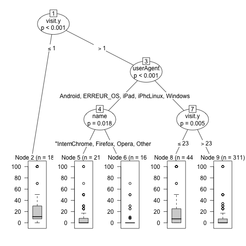
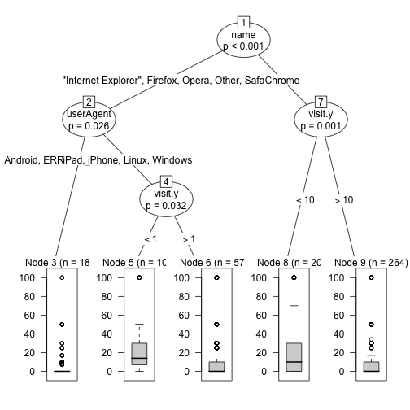
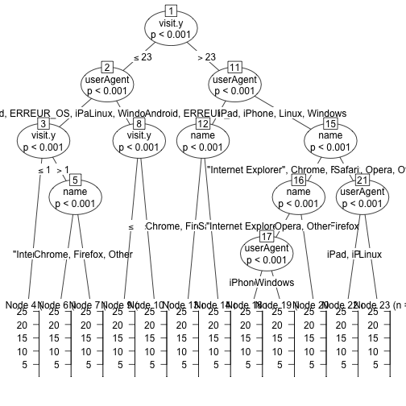
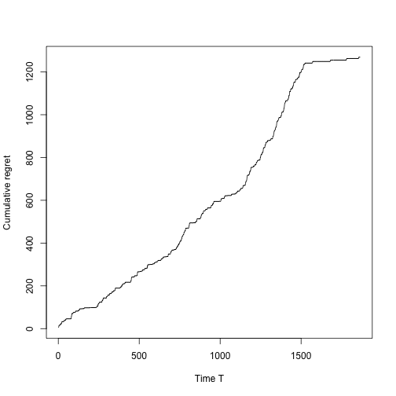
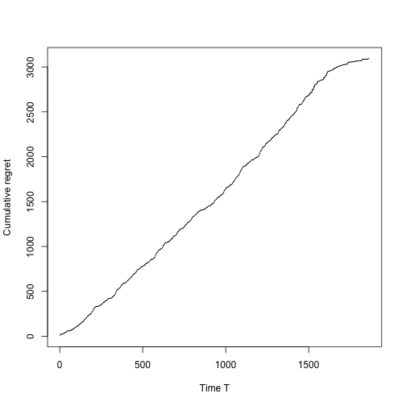
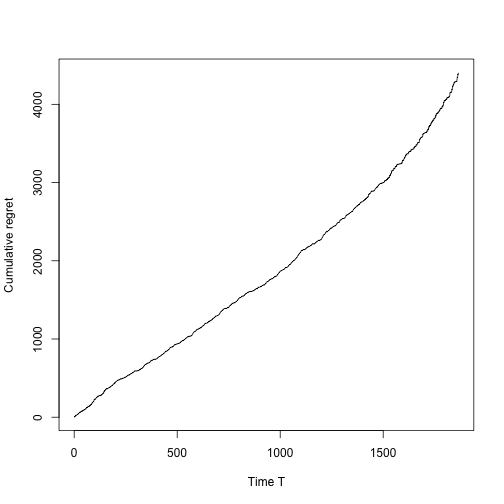
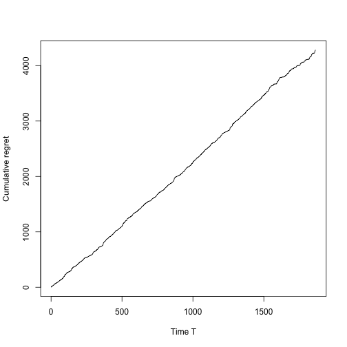
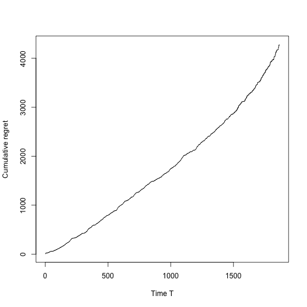
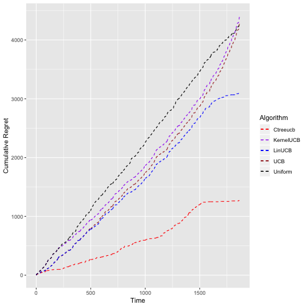

# Demonstration CtreeUCB algorithm

The purpose of this document is to compare CtreeUCB's performance to other algorithm using UCB

First we need to load the dataset called abtest3.


```r
set.seed(1234)
####Data generate
temp <- paste(getwd(),"/data/abtest3.rda",sep="")
load("/Users/Thomas/Desktop/abtest3.rda")
temp <- data3
```

The next step is the data formating and replacing missing values.


```r
##Formating
temp$value <-as.numeric( as.character(temp$value) )
temp$langID <- as.factor(temp$langID )
temp <- temp[!is.na(temp$variationID.y),]

###remplace NA in value
temp$value[is.na(temp$value)] <- 0
temp <- unique(temp)

list_col <- c("variationID.y", "visit.y","device","userAgent" ,"name" ,"value")
dt <- temp[,list_col]
summary(as.factor(dt$variationID))
```

```
##      0 100732 
## 200908 200862
```

```r
dt <- unique(dt)
```


```r
##Add test
dt$A <- NA
dt$B <- NA

for(i in 1:nrow(dt)){
  if(dt$variationID[i]== 0){ dt$A[i] = dt$value[i]
  }else{
    dt$B[i] = dt$value[i]
  }
}
```


```r
##### Regret based on conditional means ###

library(partykit)
library(bandit4abtest)

#Regression
ctree_models <- c()

#learn on A
ctree_models[[1]] <-  ctree_formula_generate(dt = dt,
                                             visitor_reward = dt[,c("A","B")],
                                             ctree_control_val = ctree_control(teststat = c("quadratic")),
                                             arm_for_learn = "A",
                                             explanatory_variable=  c("visit.y","device","userAgent" ,"name" ),
                                             learn_size = nrow(dt),
                                             print=TRUE)
```



```r
#learn on B
ctree_models[[2]] <-  ctree_formula_generate(dt = dt,
                                             visitor_reward = dt[,c("A","B")],
                                             ctree_control_val = ctree_control(teststat = c("quadratic")),
                                             arm_for_learn = "B",
                                             explanatory_variable=  c("visit.y","device","userAgent" ,"name" ),
                                             learn_size = nrow(dt),
                                             print=TRUE)
```




```r
#### Syntetique data ####
dt$A.pred <- NA
dt$B.pred <- NA

dt$A.pred <- predict(ctree_models[[1]],dt)
dt$B.pred <- predict(ctree_models[[2]],dt)
```


```r
#####################################################################
######################################################################
###################### A/B Test ########################
rm(list=ls()[! ls() %in% c("dt")])
df <- dt
```

It is possible to choose the configuration. The set up here is 30/70. It means that algorithms are learning with 70% of the dataset.


```r
####Configuration
#Conf_100/100
config <- "100_100"

#Conf_30/70
config <- "30_70"
```


```r
listCategorial =c("name","device","userAgent")
listInteger  = c("visit.y")
```


```r
#Results for each variation
visitorReward <- df[,c("A.pred","B.pred")]
```


```r
#Items caracteristics
dt <- df[, c(listCategorial,listInteger)]
```


```r
set.seed(1234)

if(config  == "100_100" ){ learn_size = nrow(dt)*1
#### replication ###
rep_data <- 2
dt <- dt[rep(1:nrow(dt),each=rep_data),]
visitorReward <- visitorReward[rep(1:nrow(visitorReward),each=rep_data),]
}
if(config  ==  "30_70"  ) learn_size = nrow(dt)*0.30

dt.old <- dt
```


```r
####CTREEUCBPARAMETER
## - the size of the learning set is already calculated according to the selected configuration (learn_size)
#  - mincriterion parameter refers to 1 -risk error accepted  (0.99,0.95,0.90)
#  - alpha refers to the dynamic allocation parameter (U.C.B)
#  - arm_for_learn is the original varitation (names(visitorReward)[1] or names(visitorReward)[2])
#  testtype and teststat is refer to type of test to build the tree (see the paper for more details)
# and are not supposed to be modified#


ctreeucb_parameters_control <- ctreeucb_parameters_control_default(dt = dt.old,
                                                                   visitorReward ,
                                                                   learn_size = learn_size,
                                                                   alpha = 1,
                                                                   arm_for_learn = names(visitorReward)[1],
                                                                   is_reward_are_boolean = FALSE,
                                                                   ctree_control_val=ctree_control(
                                                                     mincriterion = 0.95,
                                                                     testtype = "Bonferroni",
                                                                     teststat = "quadratic",
                                                                     splitstat = c( "quadratic"))
)
```

```r
my_ctree_ucb <- ctreeucbBanditObjectEvaluation(dt= dt.old,visitor_reward=visitorReward, ctree_parameters_control= ctreeucb_parameters_control, average = TRUE)
```


Maximum cumulative regret for Ctree-UCB strategy is : 

```r
max(my_ctree_ucb$cum_reg_ctree)
```

```
## [1] 1268.871
```

```r
###END CTREE UCB###
```


```r
###Data format###
###Other algorithms require binary or continuous variables.
dt <- as.data.frame(transform_categorial_to_binary( listCategorial =listCategorial ,listInteger=listInteger, dt=dt))
colnames(dt) <- paste(rep("col",ncol(dt)),as.character(c(1:ncol(dt))) ,sep="")
first <- my_ctree_ucb$ctreeucb_bandit_alloc$first_train_element
last <- nrow(dt)
dt <- dt[first:last,]
dt.reward <- dt.old[first:last,]
visitorReward <- visitorReward[first:last,]
```


```r
### Lin UCB ###
my_linucb_ucb <- LinucbBanditObjectEvaluation(dt=dt, visitor_reward=visitorReward,alpha = 1, average = TRUE, IsRewardAreBoolean = FALSE,dt.reward=dt.reward)
```


Maximum cumulative regret for Lin UCB algorithm is :

```r
max(my_linucb_ucb$cum_reg_linucb)
```

```
## [1] 3092.475
```

```r
### END Lin UCB ###
```


```r
### Kernel UCB ###
kernel_ucb <-  kernelucbBanditObjectEvaluation(dt=dt, visitor_reward=visitorReward,alpha = 1, average = TRUE, IsRewardAreBoolean = FALSE,dt.reward=dt.reward)
```


Maximum cumulative regret for Kernel UCB strategy is : 

```r
max(kernel_ucb$cum_reg_kernelucb)
```

```
## [1] 4403.103
```

```r
### END Kernel UCB ###
```


```r
### Random ###
unif_alloc <- uniform_bandit_object_evaluation(visitor_reward=visitorReward,average = TRUE, IsRewardAreBoolean = FALSE,dt.reward=dt.reward)
```


Maximum cumulative regret for Random strategy is : 

```r
max(unif_alloc$cum_reg_uniform_bandit_alloc)
```

```
## [1] 4279.699
```

```r
### END RANDOM ###
```


```r
### UCB ###
ucb_alloc <-  UcbBanditObjectEvaluation(visitor_reward=visitorReward,alpha = 1,average = TRUE, IsRewardAreBoolean = FALSE,dt.reward=dt.reward)
```




```r
max(ucb_alloc$cum_reg_ucb_alloc)
```

```
## [1] 4284.752
```

```r
###END UCB###
```


```r
### PLOT  OF REGRET###

###PLOT WITH GGPLOT2 REGRET###
library(ggplot2)

comp_reg <- data.frame(cbind(my_ctree_ucb$cum_reg_ctree,
                             ucb_alloc$cum_reg_ucb_alloc,
                             my_linucb_ucb$cum_reg_linucb,
                             kernel_ucb$cum_reg_kernelucb,
                             unif_alloc$cum_reg_uniform_bandit_alloc))


ggplot(comp_reg, aes(c(1:nrow(comp_reg)), y = value, color = Algorithm)) +
  geom_line(linetype="dashed",aes(y = my_ctree_ucb$cum_reg_ctree, col = "Ctreeucb"),size = 0.5) +
  geom_line(linetype="dashed",aes(y = ucb_alloc$cum_reg_ucb_alloc, col = "UCB"),size = 0.5) +
  geom_line(linetype="dashed",aes(y = my_linucb_ucb$cum_reg_linucb, col = "LinUCB"),size = 0.5) +
  geom_line(linetype="dashed",aes(y = kernel_ucb$cum_reg_kernelucb, col = "KernelUCB"),size = 0.5) +
  geom_line(linetype="dashed",aes(y = unif_alloc$cum_reg_uniform_bandit_alloc, col = "Uniform"),size = 0.5) +
  scale_colour_manual(values =  c("UCB"="brown","LinUCB"="blue","KernelUCB"="purple","Ctreeucb"="red","Uniform"="black"))+
  xlab("Time") +
  ylab("Cumulative Regret")
```


